# JamaAI 功能说明（编剧 / 编导版）

> 文档版本：1.1  
> 对应系统：JamaAI 1.2.8（依据 2026-07-22 本地系统实测界面与当前代码整理）  
> 适用对象：短剧编剧、编导、制片、AI 影像制作人员、项目管理员

> 本次同步：主页“AI配置”入口已统一更名为“系统配置”；AI 服务列表新增快捷设为默认；模型下拉按质量、速度、兼容性和账号可用性分组；Venice 文本配置支持同步当前账号模型；补充新一代文本、图片、视频和 TTS 模型目录。

## 1. 系统定位

JamaAI 是一套本地优先的 AI 短剧与漫剧制作系统。它把“故事构思、分集剧本、角色/场景/道具、分镜设计、分镜图、分镜视频、对白/旁白、整集合成”放在同一个项目中管理，并同时提供列表式制作页和节点画布两种工作方式。

系统适合以下工作：

- 从故事梗概生成单集或多集剧本；
- 导入小说、长文或已写好的分集内容；
- 从剧本自动提取角色、场景和关键道具；
- 建立可跨集、跨项目复用的视觉资产；
- 生成并精修结构化分镜；
- 生成角色图、场景图、道具图、分镜图和分镜视频；
- 为分镜制作对白配音、旁白字幕并合成整集视频；
- 通过 Codex AI 助手用自然语言改写剧本、补充分镜或生成素材；
- 追踪每一次文本、图片、视频和语音 AI 调用。

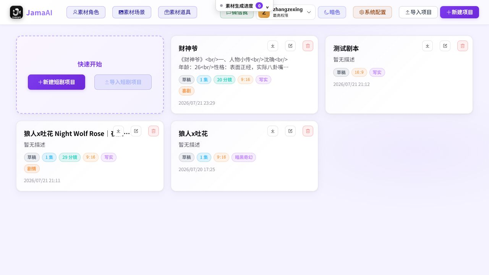

*图 1　项目列表：项目、公共素材、系统配置、导入/新建和账号入口集中在首页。*

## 2. 一条完整的制作链路

典型工作流如下：

**项目 → 分集剧本 → 角色/场景/道具 → 分镜脚本 → 分镜参考图 → 分镜视频 → 对白/旁白 → 整集合成 → 导出备份**

系统既可以逐步操作，也可以用“一键成片带图片视频”自动执行。为了便于编导审片和控制成本，实际生产更推荐先用“生成文本框架”，审完剧本、资产说明和分镜后，再进入图片和视频阶段。

## 3. 用户与权限

### 3.1 普通账号

普通账号可以进入项目、编辑剧本、管理资源、生成分镜和媒体、使用画布、项目提示词、Codex AI 助手和项目 AI 记录。

### 3.2 最高权限账号

最高权限账号在普通创作能力之外，还可以：

- 管理全系统 AI 服务配置；
- 管理系统级提示词与业务场景模型；
- 设置图片/视频并发数；
- 管理 SD2、HolyCrab 等厂商资产；
- 创建、停用、重置或删除普通账号。

普通账号不会看到“系统配置”和“账号管理”入口。账号由管理员统一创建；用户可在账号菜单中修改自己的密码或退出登录。

## 4. 功能全景

| 模块 | 主要能力 | 主要使用者 |
|---|---|---|
| 项目管理 | 新建、编辑、删除、ZIP 导入/导出、画幅设置 | 制片、编导 |
| 剧集管理 | 项目信息、分集、新增/删除、TXT 批量导入 | 编剧、编导 |
| 剧本工作台 | 故事生成、小说导入、已有剧本复用、手工编辑 | 编剧 |
| 一键全流程 | 文本框架或完整成片流水线、暂停/继续、错误记录 | 编导、AI 制作 |
| 角色资源 | AI 提取、手工新增、图像生成/上传、模板复用、身份/音色 | 编导、美术 |
| 场景资源 | AI 提取、图像生成/上传、四宫格、模板复用 | 编导、美术 |
| 道具资源 | AI 提取、手工新增、图像生成/上传、模板复用 | 编导、美术 |
| 分镜设计 | 数量/时长、经典/全能、宫格、首尾帧、旁白、摄影参数 | 编导、分镜师 |
| 分镜图 | 单镜/批量生成、上传、历史版本、主图选择、2× 超分 | 分镜师、美术 |
| 分镜视频 | 单镜/批量生成、历史切换、尾帧衔接、对白配音 | 编导、后期 |
| 成片 | 分辨率、旁白字幕、对白混音、水印、整集合成 | 编导、后期 |
| 画布模式 | 节点编排、框选工作流、整组重跑、批量生成/导出 | 编导、AI 制作 |
| Codex AI 助手 | 对话生成/改写剧本、资源、分镜、提示词和图片 | 编剧、编导 |
| 项目提示词 | 项目级覆盖、分类检索、业务场景模型映射 | 高级创作者 |
| AI 记录 | 请求检索、成功率、耗时、错误和脱敏明细 | 编导、管理员 |
| 公共素材 | 角色/场景/道具素材，跨项目搜索、编辑和复用 | 全体创作人员 |
| 系统配置/账号管理 | 服务、模型、并发、资产、账号与权限 | 管理员 |

## 5. 项目与剧集管理

### 5.1 项目首页

首页用卡片展示项目标题、描述、状态、集数、分镜数、画幅、画风、类型和更新时间。每个项目支持：

- 点击卡片进入剧集管理；
- 编辑标题和描述；
- 导出完整项目 ZIP；
- 删除项目；
- 从 ZIP 导入项目；
- 新建项目并预先设置画幅。

首页还提供明/暗主题切换、“微信我”联系支持、账号菜单和跨页面“素材生成进度”。系统中的图片普遍支持点击放大或悬停预览；列表较长时提供搜索、分页和批量操作。

可选画幅包括 16:9、9:16、3:4、1:1、4:3 和 21:9。画幅会影响后续分镜图和视频生成，竖屏短剧通常选 9:16。

### 5.2 剧集详情

剧集详情页集中管理项目标题、图片/视频风格、画面比例、故事梗概和所有分集。分集卡片显示标题、摘要、分镜数和状态，可直接进入制作页。

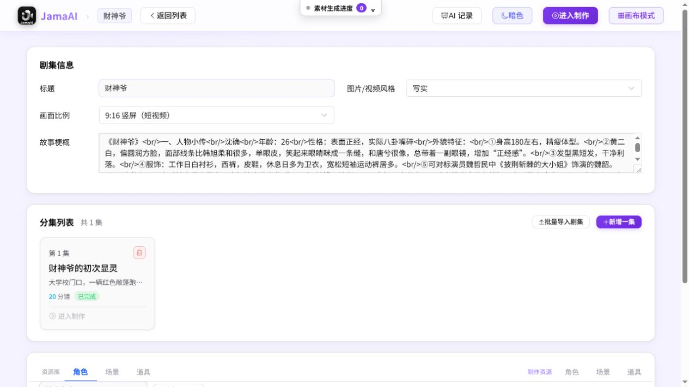

*图 2　剧集详情：上方为项目级设置，中部为分集，下方为资源库与制作资源。*

剧集支持逐集新增，也支持用 TXT 文件按章节正则批量拆分。批量导入提供预览确认，适合已有几十集文本的项目。

页面下方把资源分为两组：

- **资源库**：可复用的角色、场景、道具模板；
- **制作资源**：当前项目实际使用的角色、场景、道具。

## 6. 剧本工作台

制作页顶部是剧本工作台，提供两种方式。

### 6.1 创作剧本

- 输入故事梗概；
- 选择现代、古风、奇幻或日常等故事风格；
- 选择剧情、喜剧或冒险等类型；
- 设定生成集数；
- 由文本模型生成多集剧本；
- 选择某一集，编辑集标题和正文并保存；
- 随时添加新的一集。

### 6.2 导入小说或长文

支持粘贴文本，或拖入 `.txt` / `.md` 文件。系统可识别章节，最多一次导入 20 章；勾选“AI 转换为剧本格式”后会消耗文本模型 Token，把小说叙事转换成更适合拍摄的剧本。

### 6.3 选择已有剧本

可从其他项目选择剧本，只导入“故事梗概”和“各集剧本正文”，不会导入原项目的角色、分镜、图片或视频。这适合用同一剧本建立不同画风或不同制片方案。

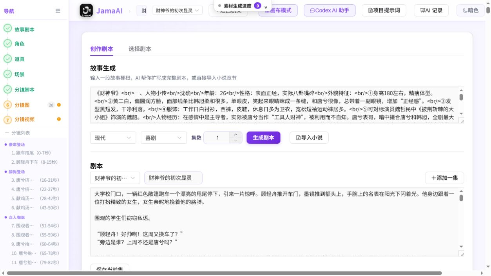

*图 3　制作页顶部：剧本、快捷导航、分镜状态和项目级工具位于同一工作台。*

## 7. 一键全流程

一键全流程提供两条路线：

- **生成文本框架**：只提取角色、场景、道具并生成分镜文本，不生成图片和视频；
- **一键成片带图片视频**：从文本资源继续生成资产图、分镜图、分镜视频并尝试完成整集。

运行前可设置：

- 项目画幅；
- 智能时长（每镜 4～15 秒）或固定 4/5/8/10/12/15 秒；
- 统一生成画风。

运行时会显示当前步骤、并行任务、阶段倒计时和错误记录，并支持暂停、继续或跳过等待。阶段倒计时用于留出人工审阅时间：例如先检查角色/场景/道具，再继续生成成本更高的分镜图和视频。

## 8. 角色、场景和道具

### 8.1 共通能力

三类资源都支持：

- 从剧本自动提取；
- 手工新增、编辑或删除；
- 编辑描述和图片提示词；
- AI 生成图片；
- 上传或拖拽本地图片；
- 保留多张历史图并切换主图；
- 保存为可复用模板；
- 加入全局素材库；
- 批量生成和批量导出；
- 查看资源影响到的分镜，并重新生成关联分镜图。

### 8.2 角色

角色卡包含姓名、主角/配角/次要角色、外貌或人物描述、主图和关联分镜。角色还支持：

- Seedance 2.0 角色身份认证，保持跨镜头人物一致性；
- 上传 Seedance 2.0 音色参考、试听或更换；
- 角色模板与复用；
- 从参考图识别和建立身份锚点（由相应业务场景提示词支持）。

*图 4　角色卡：人物说明、主图、生成/上传、模板、素材库、SD2 认证和关联分镜集中展示。*

### 8.3 场景

场景以地点、时间、描述和图片提示词为核心。可选择生成单图或四宫格场景，用于提供空间、机位和光线参考。

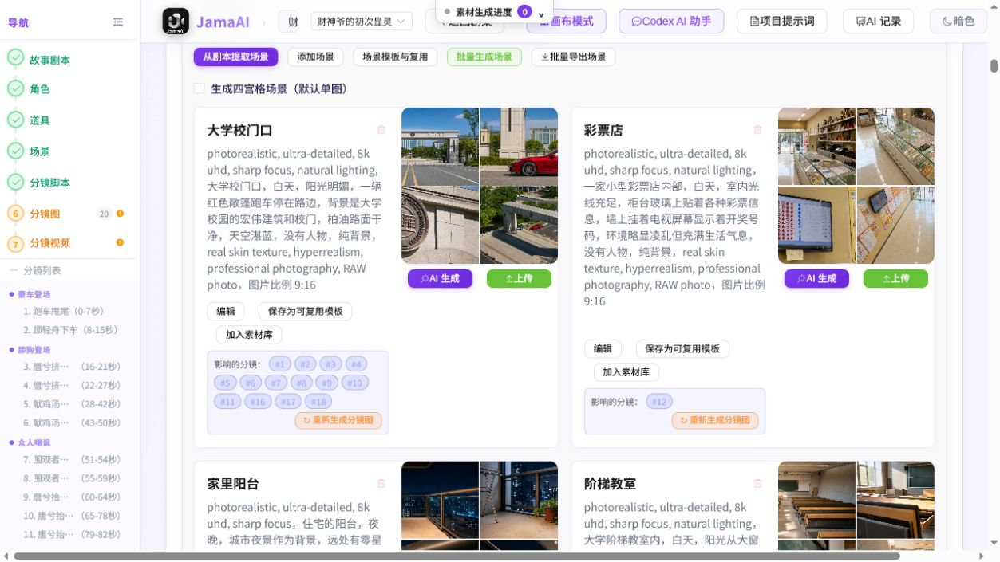

*图 5　场景卡：场景参考图和受影响分镜一目了然。*

### 8.4 道具

道具以名称、类型、描述、图片提示词和主图为核心。关键服装、武器、车辆、手机界面、信物等最好单独建立道具，以便在分镜中明确绑定。

## 9. 分镜设计

### 9.1 分镜生成策略

生成分镜前可以设置：

- 分镜数量：1～200；留空由 AI 估算；
- 视频总时长：10～600 秒；留空由 AI 估算；
- 序列图模式：单张、四宫格、九宫格；
- 首尾帧参考图；
- 全能分镜模式；
- 是否同时生成解说旁白。

生成后可导出分镜表 Excel、解说 SRT，也可批量生成分镜图、批量生成分镜视频和批量导出分镜视频。

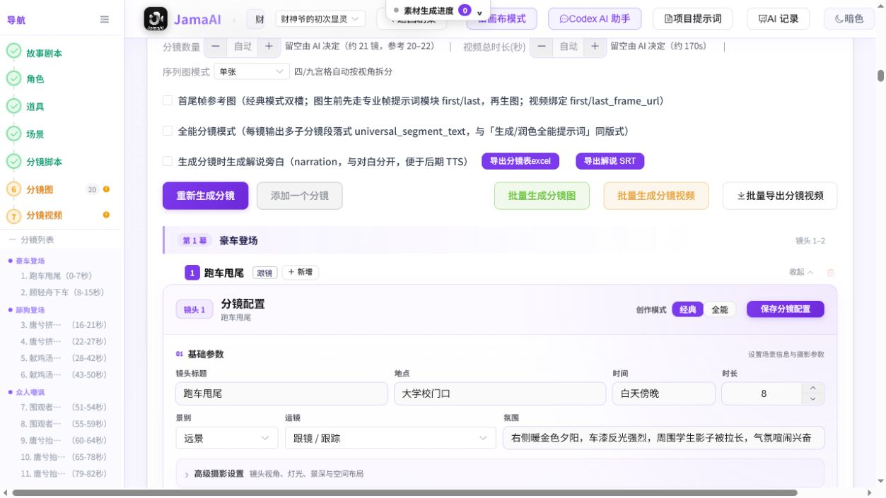

*图 6　分镜区：生成策略、批处理按钮和每镜的结构化配置。*

### 9.2 经典模式与全能模式

| 模式 | 适合场景 | 核心方式 |
|---|---|---|
| 经典模式 | 普通文生图、图生视频，便于逐帧控制 | 先生成/上传分镜参考图，再用参考图和视频提示词生视频 |
| 全能模式 | Seedance 2.0、Kling Omni 等多参考图视频模型 | 用“片段描述”组织多子分镜，并按场景→角色→道具传入多张参考图 |

全能模式支持 `@图片1`、`@图片2` 等引用。只要“片段描述”有内容，视频提交会优先使用该字段，不再拼接下方普通视频提示词。场景图通常排在第 1 张，角色和道具依次后排。

### 9.3 每个分镜可编辑的内容

基础参数：

- 镜头标题、地点、时间、时长；
- 景别、运镜、氛围；
- 镜头视角：特写/中景/远景，平视/仰拍/俯拍/虫眼，八个水平方向；
- 灯光：自然光、顺光、侧光、逆光、顶光、底光、柔光、戏剧光、黄金时段、蓝调、夜景、霓虹；
- 景深：极浅、浅、中、深景深；
- 空间布局锚点和 AI 优化。

镜头内容：

- 动作；
- 对白；
- 解说旁白；
- 动作完成后的画面结果；
- 检测到多句对白或对白/旁白混用时，可按对白拆镜。

提示词：

- 原始图片提示词；
- 通用优化提示词；
- 视频提示词；
- AI 优化提示词，但手工内容不会被自动覆盖。

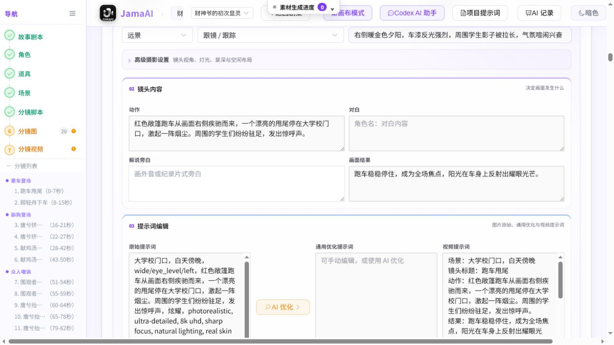

*图 7　一个分镜同时管理动作、对白、旁白、结果和三类提示词。*

### 9.4 参考素材绑定

每个分镜可以绑定一个场景、多个角色和多个道具。界面会显示缩略图，便于编导检查“人物、环境、关键物品是否齐全”。素材绑定会直接影响分镜图和全能视频的参考图集合。

## 10. 分镜图与分镜视频

### 10.1 分镜图

经典单主图模式支持：

- 生成或重新生成分镜参考图；
- 上传/拖拽替换；
- 从历史图中选择主图；
- 删除不需要的历史版本；
- 2× 超分辨率；
- 放大预览。

首尾帧模式提供独立的首帧和尾帧槽位、各自的专业提示词和历史图；视频提交时绑定 `first_frame_url` / `last_frame_url`。四宫格和九宫格可按视角拆分使用。

### 10.2 分镜视频

每镜支持：

- 生成/重新生成视频；
- 预览当前视频；
- 保留多个历史视频并切换成当前版本；
- 批量生成或批量导出；
- 提取当前视频尾帧，设为下一镜首帧；
- 有对白时生成 TTS 配音并试听。

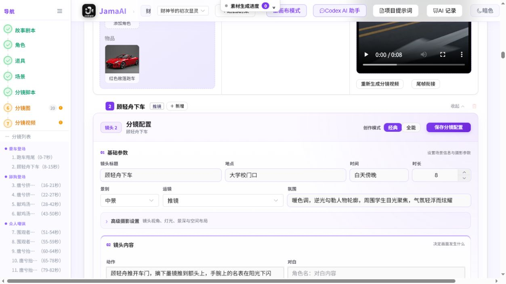

*图 8　单镜制作：左侧参考素材，中间分镜图/片段描述，右侧视频及历史版本。*

## 11. 视频配置与整集合成

整集合成支持 480p、720p、1080p，并提供：

- **字幕**：检测解说旁白，生成 SRT；旁白音频按分镜时长对齐，随后烧录字幕并混音；
- **对白烧录**：把各镜已经生成的对白 TTS 按分镜时长混入整集；
- **水印**：在右下角加入自定义文字；
- **成片预览**：合成完成后直接播放本集视频。

旁白音轨与对白音轨可以同时开启并叠混。只有已经生成分镜视频的镜头才能正常参与成片。

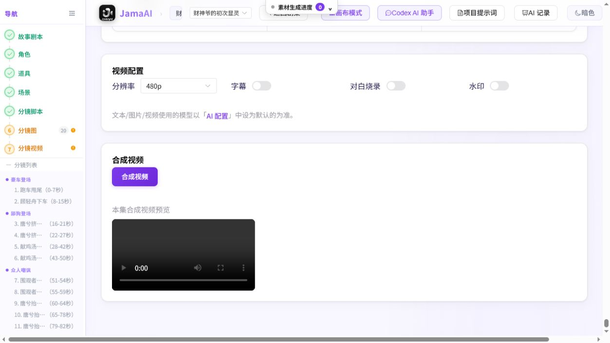

*图 9　整集输出前设置分辨率、字幕、对白和水印。*

## 12. 画布模式

画布模式与列表制作页使用同一套项目数据，改变的是组织方式。画布把剧本、资源、分镜摘要、分镜图和视频变成节点，并用连线展示依赖关系。

主要能力：

- 新建分镜、角色、场景、道具或分集；
- 拖动和对齐节点；
- 左键框选或 Ctrl 多选分镜；
- 为选中分镜建立“生图→生视频→配音”工作流；
- 保存多个工作流组并整组重跑；
- 删除工作流组；
- AI 生成分镜、批量生图、批量生视频和批量导出视频；
- 单击节点打开对应编辑面板；
- 双击分镜返回列表式详细编辑；
- 小地图浏览大型工程。

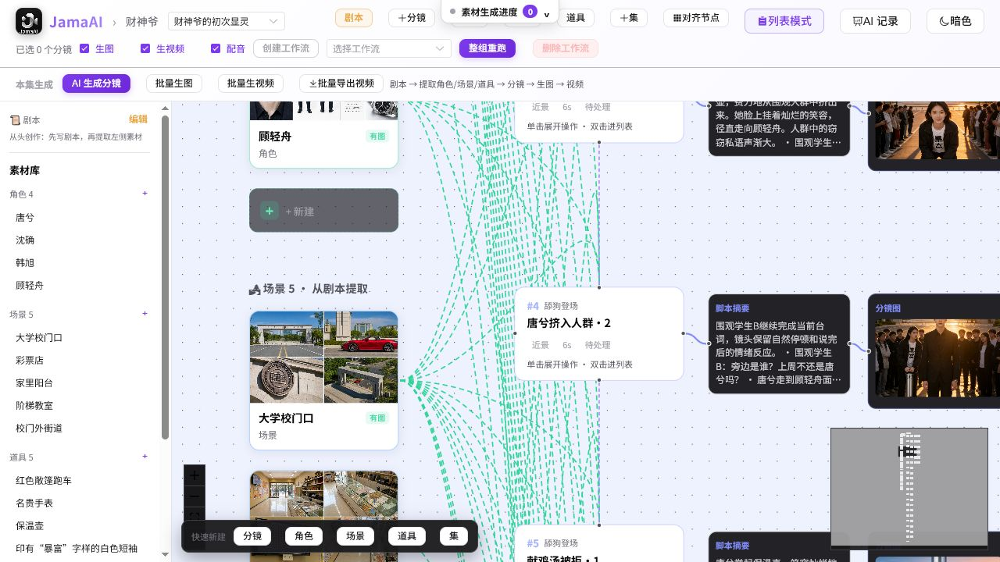

*图 10　画布模式适合查看大量镜头间的资源关系和批量工作流。*

## 13. Codex AI 助手

Codex AI 助手是项目内的自然语言创作入口。它不使用“AI 配置”中选择的普通模型，而使用独立的 Codex 运行环境。

可执行的创作意图包括：

- 生成完整剧本或当前集；
- 改写、续写当前集；
- 从剧本提取角色、道具和场景；
- 生成资源图片；
- 生成全部分镜或全部分镜图；
- 补充分镜说明、空间布局和动作结果；
- 优化指定分镜的图片/视频提示词；
- 优化资源提示词；
- 生成一张独立项目素材图；
- 普通创作咨询和分析。

执行型对话完成后，会显示“已写入/已绑定”结果；生成过程中支持进度显示和停止。提问、分析和讨论本身不会修改数据库。

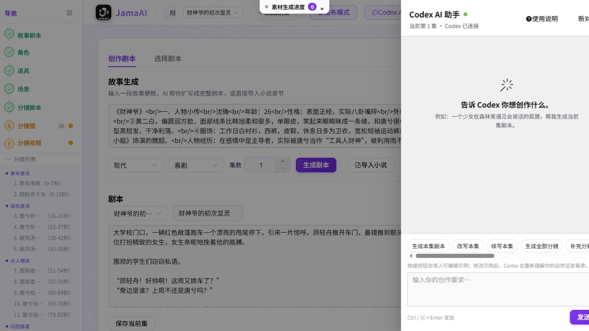

*图 11　Codex 侧栏：快捷意图只是可编辑示例，也可直接输入自然语言要求。*

## 14. 项目提示词

项目提示词允许当前项目覆盖系统默认提示词。当前系统按剧本、资产、分镜、视频等分类管理约百项模板，并标明主模板/条件子模板、System/User 消息、业务场景、变量和风险等级。

主要能力：

- 按名称、Key、分类、业务场景或模板类型搜索；
- 查看模板变量和最终注入内容；
- 为当前项目保存覆盖；
- 删除项目覆盖，恢复继承系统模板；
- 为业务场景指定文本模型；
- 预览最终组合后的提示词。

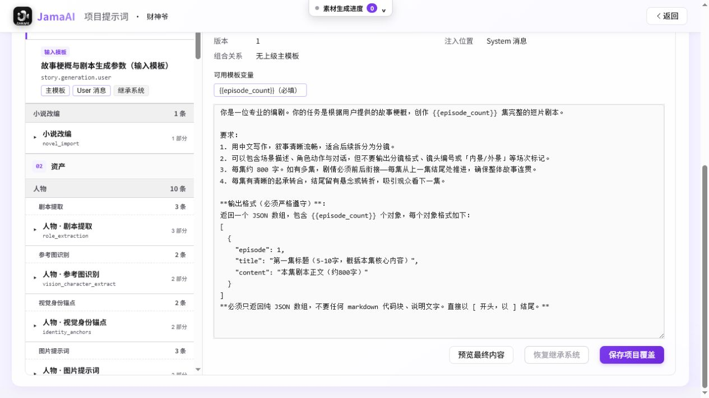

*图 12　项目覆盖只影响当前项目；删除覆盖后恢复系统默认。*

带“高风险”的系统规则、JSON 协议、变量、负向词或技术模板不适合普通编剧直接修改。变量缺失或输出格式被破坏会导致生成失败。

## 15. AI 请求记录与生成进度

### 15.1 AI 记录

项目 AI 记录展示累计请求、成功率、进行中数量、平均耗时和失败数，并支持按关键词、能力、状态和时间范围查询。

明细包含：

- 请求时间和编号；
- 文本/图片/视频/语音能力；
- 业务场景与关联任务；
- 提示词摘要；
- 模型和提供商；
- 状态、耗时和错误；
- 请求/响应详情查看。

密钥、令牌和大体积 Base64 会自动脱敏。

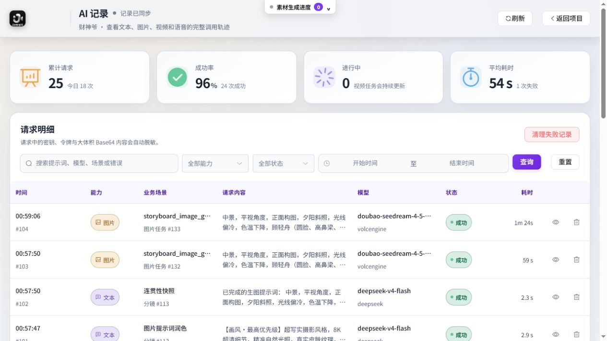

*图 13　AI 记录是定位模型、配额、提示词和网络问题的首要入口。*

### 15.2 全局生成进度

页面顶部的“素材生成进度”跨页面显示后台任务数量和状态。离开当前制作区后仍可查看任务，不需要停留在按钮旁等待。

## 16. 素材复用与媒体库

### 16.1 首页公共素材

首页提供“素材角色、素材场景、素材道具”入口。公共素材可以搜索、预览、编辑、重新上传/AI 生成图片或删除，用于跨项目复用。

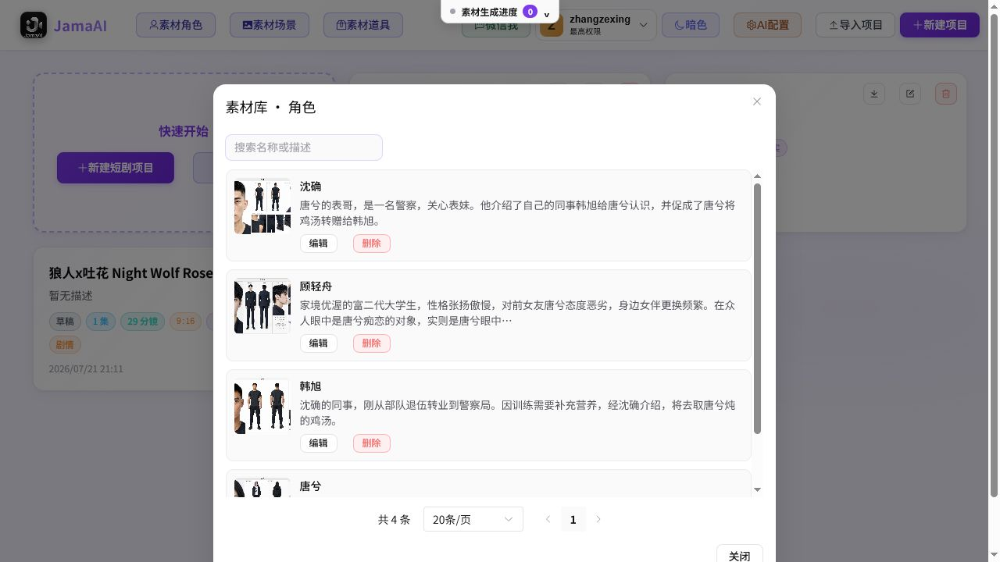

*图 14　公共角色素材库：集中管理已加入素材库的人物资产。*

### 16.2 通用媒体素材库（当前未在首页公开）

系统保留通用媒体素材库页面，可筛选图片/视频、搜索、上传、预览、单项或批量删除。它主要收集 Codex 生成的独立图片、画布素材和手工上传媒体。当前版本首页入口被隐藏，属于待完善功能，不建议把它作为正式项目归档的唯一位置。

### 16.3 自由创作（当前未在首页公开）

自由创作可以在不绑定剧集的情况下直接输入提示词生成图片或视频；视频支持可选参考图、时长和风格。当前版本首页入口同样被隐藏，属于实验/待完善入口。

## 17. 系统配置与高级管理

### 17.1 AI 服务配置

管理员可以为不同能力分别配置服务：

- 文本/对话；
- 文本生成图片（角色、场景、道具）；
- 分镜图片生成（支持参考图）；
- 视频；
- 语音合成 TTS；
- 即梦 2 角色认证；
- SD2/ModelArk 资产库。

每类服务只能有一条默认配置。配置支持添加、编辑、测试、设为默认、删除、批量删除、JSON 导入/导出，以及火山、Agnes、fal.ai、Venice、HolyCrab、通义等一键预设。非默认行可在列表中直接点击“设为默认”，切换只影响同一种服务类型，不会改变其他类型的默认项。

部署启用“厂商锁定模式”时，服务商、接口协议和 Base URL 由系统统一维护，操作人员只能修改 API Key、默认模型和默认配置；列表中的快捷“设为默认”仍可使用。这样可以统一技术线路，同时允许不同账号使用自己的密钥和默认模型。

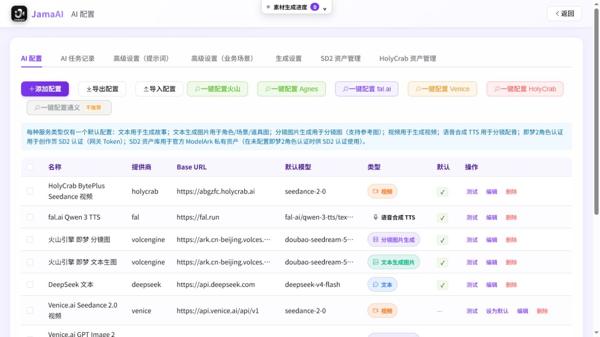

*图 15　管理员按“服务类型”设置默认模型；列表可直接切换默认项，制作页自动使用对应默认配置。*

### 17.2 模型目录与账号同步

模型下拉不再只显示一串模型 ID，而是按用途分为：

- **推荐 / 高质量**：适合定稿、关键角色图、重点分镜和质量优先的文本任务；
- **快速 / 低成本**：适合试写、批量草图、流程联调和低成本预览；
- **标准模型**：系统尚未标注档位的模型，包括管理员手工填写的自定义模型；
- **兼容 / 历史模型**：用于现有项目继续运行或新模型不可用时回退；
- **当前账号可用**：从服务商账号实时同步、但未进入系统静态目录的模型。

当前版本仅 Venice 文本配置开放“同步 Venice 模型”。系统会过滤离线、已经到期和明确不支持结构化响应的文本模型，并把账号可用项加入候选列表；同步是只读操作，不会自动修改默认模型或保存配置。未登记的自定义模型仍保留在“标准模型”中，不会因目录升级而丢失。

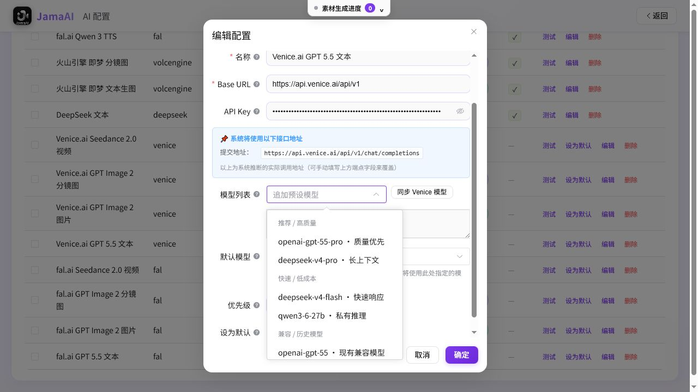

*图 16　模型按质量、速度和兼容性分组；Venice 文本配置可同步当前账号模型。*

### 17.3 新模型适配

本次目录与调用适配覆盖以下创作能力：

- **文本**：DeepSeek V4、通义千问 3.6/3.7、豆包 Seed 2.0，以及 fal.ai、Venice 的新文本模型；
- **图片与分镜图**：Seedream 5.0、通义万象 Wan 2.7 Image、Qwen Image 2.0；
- **视频**：Seedance 2.0 标准/快速/低成本版本、Wan 2.7 R2V/I2V/T2V，以及火山 Seedance 2.0；
- **语音**：fal.ai Qwen 3 TTS 1.7B、0.6B 和 Gemini Flash TTS。

对 Wan 2.7 视频，R2V 用于多参考图/故事板，I2V 用于首帧或首尾帧，T2V 用于纯文本生视频。系统会把分辨率、画幅和时长换算到模型支持范围；编导仍应先做单镜测试，再决定是否批量生成。

连接测试只验证 API Key 和基本网络，不代表模型名、账号权限、余额或配额一定能完成生成。

### 17.4 系统提示词与业务场景模型

系统级提示词管理影响所有未覆盖项目。业务场景模型表允许为故事创作、小说改编、资源提取、提示词润色、分镜生成等细分环节指定独立文本模型。

“AI 任务记录”标签提供跨项目的系统级请求视图；项目制作页的“AI 记录”只聚焦当前项目。管理员排查全局服务异常时应优先使用系统级视图。

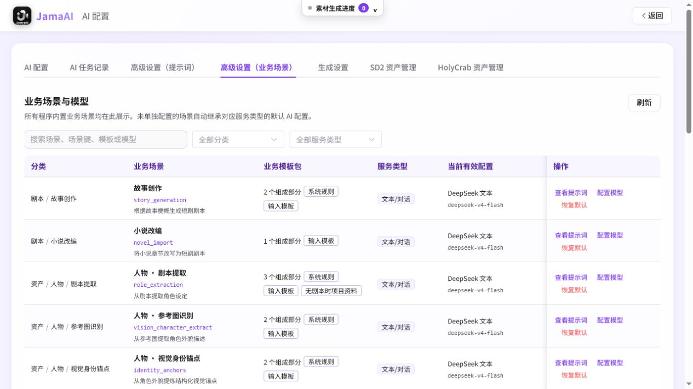

*图 17　不同业务场景可以使用不同文本配置，未单独设置时回退到默认文本模型。*

### 17.5 并发设置

图片和视频并发数可分别设置为 1～20。并发越高速度越快，也越容易触发服务商限流（429）。正式生产应根据账号额度和模型吞吐量设置。

### 17.6 SD2 与 HolyCrab 资产

- **SD2 资产管理**：对接 BytePlus ModelArk / 火山方舟私有资产库，支持 AK/SK 或 Bearer 方式，供 Seedance 2.0 的角色认证和资产引用；
- **HolyCrab 资产管理**：查询、上传本地文件、从 URL 导入、预览、下载、查看详情和删除 HolyCrab 账号内的图片/视频/音频素材。

## 18. 账号管理

管理员可以创建普通账号、启用/停用账号、重置密码或删除账号。最高权限账号受到系统保护，不能在列表中停用、删除或重置。停用、重置密码会使该账号已有登录状态失效。

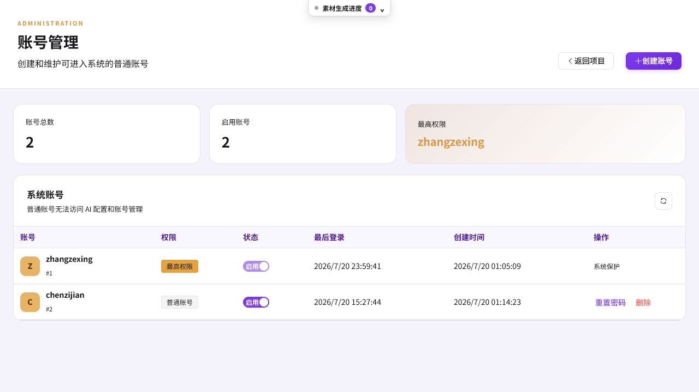

*图 18　普通账号不能访问系统配置和账号管理。*

## 19. 数据、导入导出与安全边界

- 项目业务数据保存在本地 SQLite 数据库；
- 图片、视频和音频下载到本地存储目录；
- 项目 ZIP 用于整体备份、迁移或交接；
- 分镜表可导出 Excel，旁白可导出 SRT，分镜视频可批量导出 MP4；
- 调用第三方 AI 时，提示词和必要参考图片会发送给所配置的服务商；“本地优先”不等于 AI 推理完全离线；
- API Key 只应由管理员配置，截图和 AI 记录会尽量脱敏；
- 删除项目、资源、历史图、视频和账号可能无法从界面恢复，操作前应导出项目。

## 20. 建议的岗位分工

| 岗位 | 建议负责内容 |
|---|---|
| 编剧 | 故事梗概、分集剧本、角色关系、对白与旁白 |
| 编导 | 画幅/画风、分镜数量与时长、景别运镜、节奏、版本审核 |
| 美术/AI 制作 | 角色/场景/道具提示词、参考图、主图、模型选择配合 |
| 后期 | 分镜视频选择、尾帧衔接、对白/旁白、字幕、水印、整集合成 |
| 管理员 | AI 服务、默认模型、并发、账号、系统提示词、厂商资产 |

## 21. 使用边界与注意事项

1. 生成图片、视频、TTS 和部分文本会产生第三方 API 费用；批量视频通常成本最高。
2. 生成结果不是最终创作判断。人物一致性、时空连续性、镜头节奏、对白口型和内容安全仍需人工审核。
3. “重新生成分镜”可能改变镜号和资源关联，建议先导出项目或分镜表。
4. 经典模式生成视频通常需要分镜参考图；全能模式需要正确的全能接口规范和参考图编号。
5. 首尾帧、SD2 认证、全能多图和厂商资产属于模型相关能力，只有相应服务商和模型支持时才生效。
6. 高并发容易触发 429；出现连续失败时先降低并发，再查看 AI 记录。
7. 分镜视频不完整时不要直接合成整集，否则会出现缺镜或静音段。
8. 项目提示词的高风险模板由管理员或熟悉接口协议的人维护。

## 22. 术语速查

| 术语 | 含义 |
|---|---|
| 制作资源 | 当前项目实际使用的角色、场景、道具 |
| 可复用模板 | 保存了描述和图片、可再次导入的资源模板 |
| 主图 | 当前被分镜或生成链路使用的资源图片 |
| 历史图/历史视频 | 同一资源或分镜的多个生成版本 |
| 经典模式 | 以分镜参考图 + 普通视频提示词生成视频 |
| 全能模式 | 以片段描述 + 多张参考图生成一个含多个节拍的视频 |
| 首尾帧 | 同一镜头动作前后的两张约束图 |
| 尾帧衔接 | 把上一镜视频尾帧作为下一镜的首帧参考 |
| 空间布局锚点 | 描述人物站位、构图和空间关系的连续性约束 |
| 业务场景 | 故事生成、资源提取、分镜润色等具体 AI 调用环节 |
| 项目覆盖 | 仅当前项目使用的提示词版本，优先于系统默认 |

---

更具体的点击路径、参数填写、检查点、常见问题和完整工作示例，请配合《JamaAI 操作说明书（编剧 / 编导版）》使用。
