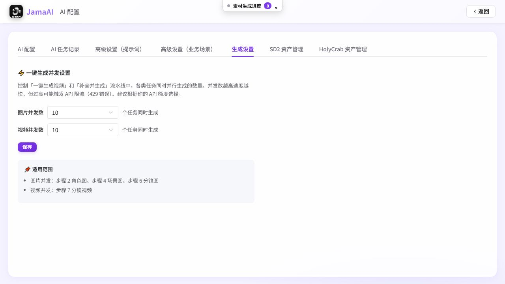
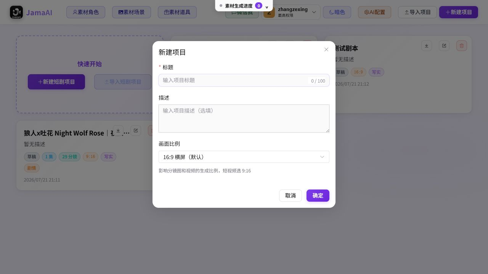
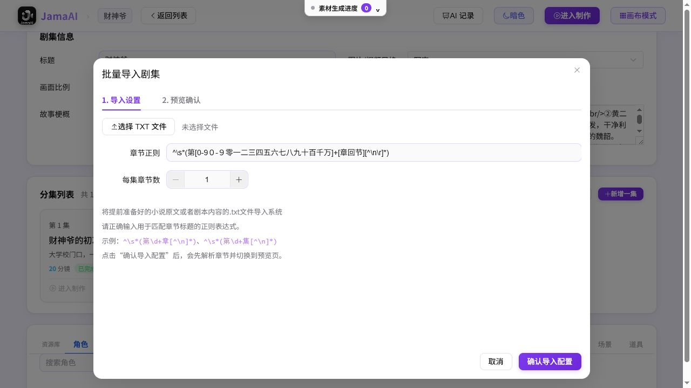
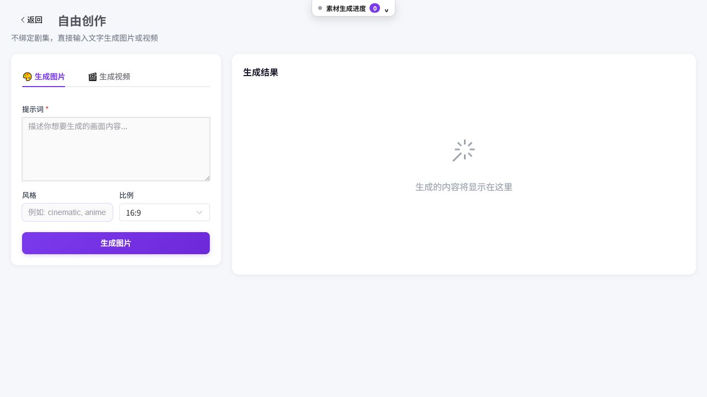
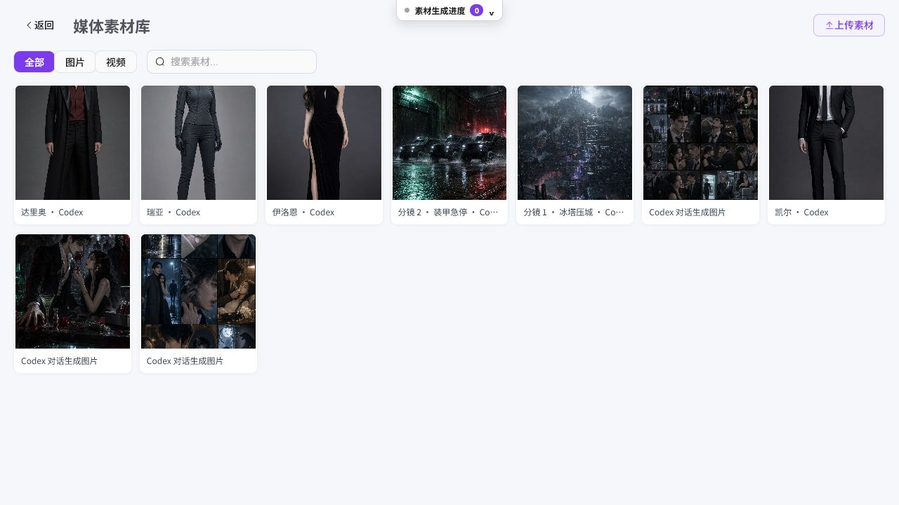

# JamaAI 操作说明书（编剧 / 编导版）

> 文档版本：1.1  
> 对应系统：JamaAI 1.2.8（2026-07-22 本地实测）  
> 本说明按“先文本、再资产、后视频”的稳妥制作顺序编写。

> 本次同步：更新“系统配置”入口、快捷设为默认、模型分组、Venice 模型同步，以及 Wan 2.7、Qwen Image 2.0、Seedream/Seedance 新模型的选择方法。

## 1. 开始之前

### 1.1 你需要准备什么

- 由管理员创建的系统账号；
- 故事梗概、已有剧本或小说/长文，至少准备一种；
- 若要使用 AI 生成功能，管理员需提前配置可用的文本、图片、视频服务；
- 若要做对白或旁白语音，需要配置 TTS 服务；
- 若要合成完整视频，确保每个需要的分镜已有可用视频片段。

### 1.2 权限说明

- 普通账号负责项目创作，看不到“系统配置”和“账号管理”；
- 最高权限账号负责模型、密钥、并发、账号和系统级提示词；
- 项目提示词对普通创作者可见，但“高风险”模板不建议非专业人员修改。

### 1.3 成本原则

AI 文本、图片、视频和语音调用可能收费。建议按下面顺序推进：

1. 先完成并保存剧本；
2. 运行“生成文本框架”；
3. 审核角色、场景、道具和分镜；
4. 少量试生成图片，确认画风和人物；
5. 先生成 1～2 条视频确认模型和节奏；
6. 最后再批量生成全部视频。

## 2. 登录与账号

1. 打开 JamaAI。
2. 输入管理员分配的账号和密码。
3. 点击“进入系统”。
4. 登录后右上角账号菜单会显示当前账号和权限。

页面右上角“明色/暗色”可切换主题；顶部“素材生成进度”用于跨页面查看后台任务。首页“微信我”是联系支持入口。

账号菜单提供：

- **修改密码**：输入当前密码、新密码和确认密码；保存后需要重新登录；
- **退出登录**；
- **账号管理**：仅最高权限账号可见。

> 密码长度为 6～128 位。不要把项目截图中的示例账号当作通用账号或默认密码。

## 3. 管理员首次配置系统 AI（普通创作者可跳过）

### 3.1 进入系统配置

在项目首页点击右上角“系统配置”。进入后默认打开“AI 配置”页签；同一页面还包含 AI 任务记录、提示词、业务场景、生成设置和厂商资产管理。

*图 1　系统配置中的 AI 配置页签按能力类型分别设置默认服务。*

### 3.2 最少需要配置哪些服务

| 想完成的工作 | 必需服务类型 |
|---|---|
| 生成故事、剧本、资源说明、分镜文本 | 文本/对话 |
| 生成角色、场景、道具图片 | 文本生成图片 |
| 生成带参考图的分镜图 | 分镜图片生成 |
| 生成分镜视频 | 视频 |
| 生成对白或旁白语音 | 语音合成 TTS |
| Seedance 2.0 角色认证 | 即梦 2 角色认证或 SD2 资产库 |

每一种服务类型必须选一条“默认”配置。制作页不会逐次询问模型，而是自动使用相应类型的默认项。

### 3.3 使用一键配置

系统提供火山、Agnes、fal.ai、Venice、HolyCrab、通义等一键预设：

1. 点击对应“一键配置”；
2. 填入该平台 API Key；
3. 确认创建；
4. 在配置列表检查文本、图片、分镜图、视频等条目是否齐全；
5. 对需要的条目点击“设为默认”。

如果使用自建或中转服务，点击“添加配置”，按服务商文档填写服务类型、厂商、接口规范、Base URL、提交/查询端点、模型列表、默认模型和 API Key。

### 3.4 快速切换默认配置

每种服务类型只能有一条默认配置。需要换服务商或模型线路时：

1. 在列表中找到目标配置；
2. 确认它的“类型”与当前工作一致，例如文本、分镜图片或视频；
3. 点击该行“设为默认”；
4. 看到目标行“默认”列出现勾，原同类型默认行自动取消。

这个操作只切换同一种服务类型，不影响其他类型。例如把 Venice 文本设为默认，不会改变图片和视频的默认配置。已经是默认的行不会再显示“设为默认”。

如果页面顶部显示“厂商锁定模式”，服务商、接口规范和 Base URL 已由系统统一维护，不能自行改动；仍可修改 API Key、默认模型，并用“设为默认”切换同类型默认配置。需要变更接口线路时联系系统维护人员。

### 3.5 按模型档位选择

点击配置行“编辑”，在“模型列表”或“默认模型”下拉中按分组选择：

| 模型分组 | 建议用法 |
|---|---|
| 推荐 / 高质量 | 剧本定稿、重点角色图、关键分镜和最终交付 |
| 快速 / 低成本 | 试写、批量草图、流程联调和低成本预览 |
| 标准模型 | 自定义模型或系统尚未标注档位的模型 |
| 兼容 / 历史模型 | 旧项目延续或新模型不可用时回退 |
| 当前账号可用 | 从服务商账号同步、但不在静态预设中的模型 |

1. 在“追加预设模型”中选择需要的模型；
2. 确认模型 ID 已加入下方模型列表；
3. 在“默认模型”中选择实际生成时使用的模型；
4. 需要同时切换线路时，打开“设为默认”；
5. 点击“确定”保存。

未登记的自定义模型可以继续手工填写，并显示在“标准模型”中。分组和提示是制作选型参考，不等于账号已开通该模型，也不保证配额充足。

*图 2　模型按质量、速度和兼容性分组；Venice 文本配置可同步账号模型。*

### 3.6 同步 Venice 文本模型

“同步 Venice 模型”只在**已经保存的 Venice 文本配置**中显示：

1. 在 Venice 文本配置行点击“编辑”；
2. 点击“同步 Venice 模型”；
3. 等待“已同步 N 个”提示；
4. 展开“追加预设模型”，从“当前账号可用”或其他分组选择模型；
5. 选择默认模型后点击“确定”。

同步只读取账号的模型目录，不会自动改默认模型，也不会自动保存。系统会过滤离线、已经到期和明确不支持结构化响应的文本模型。其他厂商当前仍使用系统预设或管理员手工填写的模型列表。

### 3.7 选择新一代图片和视频模型

| 制作目标 | 建议选择 |
|---|---|
| 高质量文本定稿 | “推荐 / 高质量”中的 DeepSeek V4、通义千问 3.7、豆包 Seed 2.0 等可用模型 |
| 快速文本试写 | “快速 / 低成本”中的 Flash、Lite 或高吞吐模型 |
| 角色/场景/道具图 | Seedream 5.0、Wan 2.7 Image、Qwen Image 2.0 中账号已开通的模型 |
| 多参考图或故事板视频 | Wan 2.7 R2V |
| 首帧或首尾帧视频 | Wan 2.7 I2V |
| 纯提示词视频 | Wan 2.7 T2V |
| Seedance 视频 | 标准版用于质量优先，Fast/Mini 用于速度或成本优先 |

Wan 2.7 视频会由系统把时长、分辨率和画幅换算到模型支持范围；当前适配的时长为 2～15 秒，分辨率为 720P 或 1080P。模型和账号规则可能不同，正式批量生成前始终先做 1 个单镜测试。

### 3.8 测试和核对

点击配置行的“测试”。连接成功只说明 Key 基本有效、网络可达，仍需用一个小任务验证：

- 模型 ID 是否正确；
- 账号是否开通该模型；
- 是否有余额/配额；
- 视频查询端点是否匹配；
- 参考图数量和图片 URL 是否符合服务商要求。

### 3.9 设置并发

进入“生成设置”，分别设置图片和视频并发数。

*图 3　图片和视频并发可分别调整。*

建议：

- 初次联调：图片 1～2，视频 1；
- 稳定后：按服务商限额逐步提升；
- 经常出现 429：立即降低并发；
- 视频服务通常比图片服务更容易受并发限制。

## 4. 项目首页

*图 4　首页显示项目、公共素材、导入导出、系统配置和账号入口。*

### 4.1 新建项目

1. 点击右上角“新建项目”，或快速开始卡片中的“新建短剧项目”。
2. 填写项目标题。
3. 可填写描述或故事梗概。
4. 选择画面比例。
5. 点击“确定”。

*图 5　画幅会贯穿分镜图和视频；竖屏短剧一般选 9:16。*

画幅建议：

| 发布场景 | 建议画幅 |
|---|---|
| 抖音、快手、视频号竖屏短剧 | 9:16 |
| 横屏短片、B 站、电视 | 16:9 |
| 方形社交内容 | 1:1 |
| 宽银幕风格 | 21:9 |

### 4.2 导入项目

1. 点击“导入项目”；
2. 选择由 JamaAI 导出的 `.zip` 项目包；
3. 等待导入完成；
4. 检查项目卡片、集数、分镜和素材。

导入项目适合换电脑、多人交接或恢复备份。不要手工改 ZIP 内部目录结构。

### 4.3 导出、编辑和删除

项目卡片右上角三个按钮依次用于：

- 导出项目 ZIP；
- 编辑标题和描述；
- 删除项目。

删除前务必导出备份。ZIP 是项目级最完整的交接方式。

## 5. 设置项目与分集

点击项目卡片进入剧集详情。

*图 6　先确定项目风格和比例，再管理分集和资源。*

### 5.1 项目级信息

检查并修改：

- 标题；
- 图片/视频风格；
- 画面比例；
- 故事梗概。

画风和比例改变后，旧图片/视频不会自动重做。若中途改风格，需人工决定哪些资源需要重新生成。

### 5.2 新增一集

1. 点击“新增一集”；
2. 系统建立新的分集记录；
3. 点击分集卡片进入制作页；
4. 在制作页填写集标题和剧本正文并保存。

### 5.3 批量导入分集

适合已有多集 TXT 的编剧或制片：

1. 点击“批量导入剧集”；
2. 选择 TXT 文件；
3. 检查“章节正则”；
4. 设置每集包含多少章节；
5. 点击“确认导入配置”；
6. 在第二步预览拆分结果；
7. 确认后正式导入。

*图 7　正则需能匹配“第1集、第一章”等标题；先预览再导入。*

如果预览只得到一集，先检查原文章节标题是否独占一行，再调整正则。

## 6. 进入制作页

在剧集详情点击“进入制作”，或直接点击某一集卡片。

制作页的左侧快捷导航依次显示：

- 故事剧本；
- 角色；
- 道具；
- 场景；
- 分镜脚本；
- 分镜图；
- 分镜视频；
- 当前集全部分镜及时间段。

顶部还可切换分集、进入画布模式、打开 Codex AI 助手、项目提示词、AI 记录和 AI 配置。

## 7. 完成剧本

*图 8　“创作剧本”和“选择剧本”是两种独立入口。*

### 7.1 从梗概生成剧本

1. 在“创作剧本”输入故事梗概；
2. 选择故事风格；
3. 选择剧本类型；
4. 输入集数；
5. 点击“生成剧本”；
6. 等待生成结束；
7. 逐集检查标题和正文；
8. 点击“保存当前集”。

编剧检查重点：

- 每集是否有清晰冲突、转折和结尾钩子；
- 人物目标和关系是否前后一致；
- 对白是否可表演、可配音；
- 场景和道具是否可视化；
- 一镜内容是否过多，是否需要在分镜阶段拆分。

### 7.2 手工录入或修改

可以直接编辑集标题和剧本正文，不必使用 AI。修改后点击“保存当前集”。

### 7.3 导入小说/长文

1. 点击“导入小说”；
2. 选择“粘贴文本”或“上传文件”；
3. 文件支持 `.txt` / `.md`；
4. 设置最多导入集数（1～20）；
5. 如需改成剧本表达，勾选“AI 转换为剧本格式”；
6. 点击“开始导入”；
7. 检查识别出的章节和剧本；
8. 保存并逐集修订。

“AI 转换为剧本格式”会消耗 Token；如果原稿已是标准剧本，可不勾选。

### 7.4 复用已有剧本

1. 切换到“选择剧本”；
2. 点击“从已有剧本中选择”；
3. 选择其他项目；
4. 系统只复制梗概和分集正文；
5. 切回“创作剧本”继续编辑。

此操作不会复制角色、分镜、图片或视频，适合重做不同视觉版本。

## 8. 选择自动或手动生产路线

### 8.1 推荐：先生成文本框架

1. 确定画幅；
2. 选择智能或固定镜头时长；
3. 选择画风；
4. 点击“生成文本框架”；
5. 等待角色、场景、道具和分镜文本生成；
6. 人工审核后再生成图片。

这条路线最适合编剧/编导，因为可以在产生大量图片和视频费用前修正结构问题。

### 8.2 一键成片

1. 确认文本、画幅、时长和画风；
2. 点击“一键成片带图片视频”；
3. 关注当前步骤、并行任务和错误日志；
4. 每个阶段倒计时时检查结果；
5. 需要修改时点击“暂停”；
6. 修改后点击“继续”，或“立即开始下一阶段”。

> 一键流程不是无人审核模式。角色长相、场景空间、镜头数量和视频质量仍需人工确认。

## 9. 建立角色、场景和道具

### 9.1 自动提取

在对应区域点击：

- “剧本自动提取角色”；
- “从剧本提取场景”；
- “从剧本提取道具”。

提取后先检查名称和描述，不要马上批量生图。错误的资源说明会被带入所有后续分镜。

### 9.2 手工新增

角色：填写姓名、角色类型、外貌、性格和描述。  
场景：填写地点、时间、环境说明和图片提示词。  
道具：填写名称、类型、视觉说明和图片提示词。

### 9.3 生成或上传资源图

每张资源卡支持“AI 生成”和“上传”：

1. 先点击“编辑”，完善说明和提示词；
2. 点击“AI 生成”，或上传设计稿/定妆照；
3. 点击图片放大检查；
4. 多次生成后，从历史图中选一张设为主图；
5. 不要删除仍可能需要回退的版本。

*图 9　角色主图会进入分镜参考图和全能视频参考集合。*

角色审图重点：

- 年龄、脸型、发型和服装是否符合人物设定；
- 正面/侧面/全身信息是否足够；
- 角色之间是否容易混淆；
- 图片是否包含多余人物、文字或分屏；
- 多集角色是否使用同一主图和一致身份锚点。

场景审图重点：

- 空间结构是否可支持预定调度；
- 昼夜、天气和光线是否正确；
- 画幅方向是否一致；
- 四宫格是否只用作多视角参考，生成单镜时需明确“禁止分屏宫格”。

*图 10　场景图是空间和光线约束，不只是背景装饰。*

### 9.4 模板与素材库

- **保存为可复用模板**：把资源保存成可再次导入的模板；
- **加入素材库**：放入首页公共素材，供其他项目使用；
- **角色模板与复用/场景模板与复用/道具模板与复用**：从已有模板导入当前项目；
- **批量导出**：按资源名称导出 JPG/MP4 文件。

### 9.5 SD2 认证和音色

仅在使用 Seedance 2.0 且管理员已配置相关认证时操作：

1. 为角色确定最终主图；
2. 点击“SD2认证”；
3. 等待状态变为有效；
4. 如更换主图，根据提示刷新认证；
5. 需要视频音色参考时上传音色，可试听或更换。

这套音色参考只对 Seedance 2.0 模型生效，不等同于整集合成使用的普通 TTS 配置。

## 10. 生成分镜

### 10.1 设置分镜数量和总时长

在“5. 分镜生成”区域填写：

- 分镜数量 1～200，或留空由 AI 决定；
- 视频总时长 10～600 秒，或留空由 AI 决定；
- 序列图：单张、四宫格、九宫格。

对话密集的短剧不要把单镜时长压得过短。一个镜头内出现多句对白时，后续可用“按对白拆镜”。

### 10.2 选择模式

**经典模式**：

1. 先有分镜参考图；
2. 再用参考图和视频提示词生成视频；
3. 适合逐帧可控、首尾帧和普通图生视频。

**全能模式**：

1. 管理员的视频配置接口规范需为 `volcengine_omni` 或 `kling_omni` 等全能协议；
2. 每镜使用“片段描述”；
3. 场景、角色、道具作为多张参考图；
4. 文案用 `@图片1`、`@图片2` 对应参考图；
5. 适合在一个视频中生成多个节拍或动作段落。

### 10.3 可选高级策略

- **首尾帧参考图**：经典模式下为动作前后建立双槽；
- **全能分镜模式**：生成多子分镜段落式片段描述；
- **生成解说旁白**：把 narration 与对白分开，便于 TTS 和 SRT；
- **宫格模式**：按多个视角生成并拆分；
- **导出分镜表 Excel**：供导演、摄影或制片流转；
- **导出解说 SRT**：供后期字幕使用。

### 10.4 生成与审核

1. 点击“AI 生成分镜”；
2. 等待所有分镜出现；
3. 检查镜头数量、总时长和节奏；
4. 检查每镜的人物、场景和道具；
5. 检查对白是否被拆到合理镜头；
6. 不满意时先手工改，必要时再“重新生成分镜”。

*图 11　重新生成前建议先导出项目或分镜表，避免镜号变化影响已有媒体。*

## 11. 精修每个分镜

### 11.1 基础参数

逐镜填写或检查：

- 镜头标题；
- 地点、时间；
- 时长；
- 景别；
- 运镜；
- 氛围。

### 11.2 高级摄影设置

展开“高级摄影设置”，可控制：

- 特写/中景/远景；
- 平视、低角仰拍、高角俯拍、虫眼仰视；
- 正面、左右侧、前后 45°/135°、背面；
- 灯光；
- 景深；
- 空间布局锚点。

空间布局锚点用于描述“谁站在哪、看向哪里、谁在前景/背景、门窗和道具在什么方向”。首尾帧和相邻镜头连续性不稳时，优先补这一项。

### 11.3 镜头内容

分别填写：

- 动作；
- 对白；
- 解说旁白；
- 画面结果。

“画面结果”要写镜头结束时的状态，例如“唐兮停在门口，手仍握住保温壶，回头看向韩旭”，这样尾帧和下一镜更容易连贯。

### 11.4 提示词

系统为每镜保存三类提示词：

- 原始提示词；
- 通用优化提示词；
- 视频提示词。

点击“AI 优化”可从原始提示词生成通用优化版本。手工编辑不会被自动覆盖，保存分镜配置后一起入库。

*图 12　先把动作、对白和结果写清楚，再调摄影参数和提示词。*

### 11.5 绑定参考素材

1. 在“参考素材”选择场景；
2. 选择本镜出现的角色；
3. 选择关键道具；
4. 检查缩略图是否正确；
5. 全能模式下核对参考图顺序和 `@图片N`。

一个分镜只绑定真正需要的素材。无关参考图过多会降低模型对关键人物和动作的关注。

## 12. 生成分镜图

### 12.1 单主图模式

1. 确认分镜配置已保存；
2. 点击“生成分镜参考图”；
3. 等待任务完成；
4. 放大检查人物、空间、构图和画幅；
5. 不满意时修改提示词后重新生成；
6. 在历史图中选定主图；
7. 必要时点击“超分”进行 2× 放大。

也可以点击“上传”，用分镜草图、实拍参考或外部生成图替换。

### 12.2 首尾帧模式

1. 在分镜生成区勾选“首尾帧参考图”；
2. 为每镜分别生成首帧和尾帧；
3. 检查人物站位和动作变化是否合理；
4. 从各自历史中选择首帧/尾帧；
5. 生成视频时系统会绑定两个槽位。

不要让首帧和尾帧的服装、人物数量、镜头方向或场景结构无故变化。

### 12.3 批量生图

先用 1～2 镜验证默认图片模型，再点击“批量生成分镜图”。运行时可查看进度、失败记录并停止后续提交。

## 13. 生成分镜视频

### 13.1 单镜生成

1. 经典模式先确认有主分镜图；
2. 全能模式先确认片段描述和多图引用；
3. 检查视频提示词、镜头时长和参考素材；
4. 点击“生成分镜视频”；
5. 等待完成并播放；
6. 需要时修改提示词后重新生成；
7. 在历史视频中选择最终版本。

*图 13　保留历史版本，选定的当前视频才会用于整集合成。*

视频审查清单：

- 人物身份、服装、发型是否一致；
- 动作是否在时长内完成；
- 镜头方向、景别和运镜是否符合设计；
- 是否出现多余人物、肢体异常、文字乱码；
- 对白与画面节奏是否匹配；
- 结尾状态能否接下一镜。

### 13.2 尾帧衔接

有下一镜时可点击“尾帧衔接”：

1. 系统提取当前视频尾帧；
2. 把它设为下一镜首帧参考；
3. 下一镜重新生成视频；
4. 检查接点是否减少跳变。

只有支持图生视频/首帧约束的模型才能真正利用该参考。

### 13.3 对白配音

当分镜有对白时：

1. 点击“对白配音”；
2. 等待 TTS 完成；
3. 点击播放按钮试听；
4. 修改对白或 TTS 配置后可重新生成；
5. 合成整集时打开“对白烧录”。

### 13.4 批量生视频和导出

确认少量样片通过后，再点击“批量生成分镜视频”。生成完成可“批量导出分镜视频”，按镜头获得 MP4 文件包。

## 14. 合成整集视频

在制作页左侧点击“分镜视频”，跳到页面底部。

*图 14　只有选定的当前分镜视频会进入整集合成。*

### 14.1 合成前检查

- 每个必需分镜都有选定的当前视频；
- 镜头顺序和时长正确；
- 不需要的失败/测试视频没有被选为当前版本；
- 对白 TTS 已试听；
- 旁白文案已检查；
- 已决定是否加字幕、对白烧录和水印。

### 14.2 设置输出

1. 选择 480p、720p 或 1080p；
2. 开启“字幕”可生成旁白 SRT、旁白语音并烧录；
3. 开启“对白烧录”可把各镜对白 TTS 混入；
4. 开启“水印”并填写右下角文字；
5. 点击“合成视频”；
6. 等待完成；
7. 在“本集合成视频预览”播放检查。

如果旁白过长，系统会尝试加速；过短会补静音。仍建议编剧把旁白长度控制在镜头时长内。

## 15. 使用画布模式

从剧集详情或制作页点击“画布模式”。

*图 15　节点连接表示剧本、素材、分镜图和视频之间的依赖。*

### 15.1 基本操作

- 拖动节点调整布局；
- 使用“对齐节点”自动整理；
- 用左侧素材栏定位角色、场景和道具；
- 单击节点展开编辑；
- 双击分镜进入列表式详细页；
- 用小地图快速移动到大型画布的其他区域；
- 点击“列表模式”返回制作页。

### 15.2 建立批量工作流

1. 框选分镜，或 Ctrl 点击多选；
2. 勾选“生图、生成视频、配音”中的需要步骤；
3. 点击“创建工作流”；
4. 输入工作流名称；
5. 从下拉框选择工作流；
6. 点击“整组重跑”；
7. 检查执行进度和失败镜头。

工作流适合按场次、人物或交付批次组织镜头。例如“第一场夜戏”“女主定妆版”“客户修改镜头”。删除工作流组不会等同于删除项目分镜，但操作前仍应确认提示。

## 16. 使用 Codex AI 助手

点击制作页顶部“Codex AI 助手”。

*图 16　快捷按钮会填入示例，可继续改成自己的要求。*

### 16.1 可直接提出的任务

- “把当前集改得更紧凑，前 15 秒出现冲突，保持结尾不变。”
- “续写当前集 600 字，加入男主第一次正面出场。”
- “从当前集提取角色、场景和道具，补完整视觉说明并写入资源库。”
- “生成当前集全部分镜，每镜 6～10 秒，补足动作、画面结果和空间布局。”
- “优化第 3 镜的通用图片提示词和视频提示词，不生成图片。”
- “为尚无图片的角色和场景分别生成资源图并绑定。”

### 16.2 写好指令的四个要素

1. **动作**：生成、改写、续写、提取、优化还是配图；
2. **范围**：当前项目、当前集、所有分镜、第几镜、哪个角色；
3. **约束**：保留什么、覆盖什么、时长、风格、画幅；
4. **落库要求**：是否写入数据库、只改提示词还是同时生成图片。

### 16.3 结果判断

- 对话中出现“已写入/已绑定”，说明执行结果已保存；
- 普通讨论和分析不会修改项目；
- 生成中可点击“停止生成”；
- 复杂任务建议按“剧本→资源说明→资源图→分镜→分镜图”分步发送；
- Codex 不使用 AI 配置页的普通模型，故其结果和费用/权限链路与常规模型不同。

## 17. 项目提示词

点击制作页顶部“项目提示词”。

*图 17　左侧选择业务模板，右侧查看变量、来源和正文。*

### 17.1 修改项目级提示词

1. 用搜索和分类找到业务场景；
2. 选择具体模板；
3. 阅读模板变量和风险提示；
4. 修改正文；
5. 点击“预览最终内容”；
6. 点击“保存项目覆盖”。

项目覆盖只影响当前项目，优先于系统提示词。

### 17.2 恢复默认

点击“恢复继承系统”，删除当前项目的覆盖版本。之后自动使用系统级模板。

### 17.3 不要随意修改的内容

- JSON 输出结构；
- 必填变量，如 `{{episode_count}}`；
- System/User 消息角色；
- 技术模板和负向词；
- 全能视频多段格式；
- 标记为“高风险”的模板。

一旦生成突然无法解析，先恢复系统继承再重试。

## 18. 查看 AI 记录和定位故障

点击制作页或剧集详情的“AI 记录”。

*图 18　按能力、状态和时间筛选，查看模型与失败详情。*

### 18.1 常用排查方法

1. 先看失败任务属于文本、图片、视频还是语音；
2. 查看业务场景和使用的模型；
3. 打开详情查看错误；
4. 对照下表处理；
5. 修改后用单个任务验证，不要马上批量重跑。

| 现象 | 常见原因 | 处理 |
|---|---|---|
| 401 / Unauthorized | API Key 无效、认证头或 AK/SK 错误 | 更新 Key，核对接口规范 |
| 403 / Forbidden | 模型未开通、权限或区域不匹配 | 在厂商控制台开通模型/权限 |
| 404 | Base URL、Endpoint 或模型 ID 错误 | 对照厂商文档修改 |
| 429 | 并发过高或额度限制 | 降低并发，稍后重试 |
| 超时 | 视频生成慢、轮询配置或网络问题 | 单镜重试，核对查询端点和超时 |
| 图片参考失败 | 本地 URL 外部不可访问、图数/格式不支持 | 使用可访问图床/代理，减少参考图 |
| 视频无结果 | 模型名、任务 ID 解析或查询协议不匹配 | 检查视频接口规范和返回格式 |
| JSON 解析失败 | 提示词模板输出格式被改坏 | 恢复系统提示词或项目继承 |
| 人物不一致 | 主图/身份锚点未统一，参考图过多或冲突 | 固定主图，清理参考图，使用 SD2 认证 |

AI 记录会自动脱敏密钥、令牌和大体积 Base64，但导出或分享截图前仍应人工检查。

## 19. 公共素材与备份

### 19.1 首页公共素材

点击“素材角色、素材场景、素材道具”可搜索、预览、编辑或删除跨项目素材。

*图 19　项目中点击“加入素材库”后，可在首页统一管理。*

复用建议：

- 用统一命名，如“唐兮-大学阶段-白色暴富T恤”；
- 在描述中写清年代、年龄、服装、状态；
- 不要用“女主1”“场景2”这类难以跨项目理解的名称；
- 删除公共素材前确认没有其他项目依赖。

### 19.2 备份节奏

建议在以下节点导出项目 ZIP：

- 剧本定稿；
- 角色/场景定稿；
- 分镜定稿；
- 批量生图前；
- 批量生视频前；
- 客户审阅版交付前；
- 大规模重新生成或删除前。

文件名可使用：`项目名_集数_阶段_日期.zip`，例如 `财神爷_E01_分镜定稿_20260722.zip`。

## 20. 管理账号（管理员）

从右上角账号菜单进入“账号管理”。

*图 20　最高权限账号受到保护；普通账号可停用、重置和删除。*

### 20.1 创建账号

1. 点击“创建账号”；
2. 输入 3～50 位账号名；
3. 输入 6～128 位初始密码；
4. 保存后把账号和初始密码用安全方式交给使用者；
5. 要求使用者首次登录后修改密码。

账号名可使用字母、数字、点、下划线和短横线。

### 20.2 停用、重置或删除

- 关闭“启用”开关会使账号不能继续使用；
- “重置密码”会使已有登录状态失效；
- “删除”会移除账号；
- 最高权限账号不能在此停用、删除或重置。

## 21. 当前未公开的实验入口

系统代码中保留“自由创作”和“媒体素材库”，但当前版本首页入口被隐藏，功能标记为待完善。

### 21.1 自由创作

可在不绑定剧集时直接生成图片或视频；图片可选画幅，视频可上传参考图并设置时长。

### 21.2 通用媒体素材库

可筛选图片/视频、搜索、上传、预览、删除和批量删除，包含 Codex 生成的独立素材。

正式项目仍应以项目资源、项目 ZIP 和分镜导出为主要归档方式。

## 22. 三种常见生产方案

### 方案 A：编剧先行、逐层审核（推荐）

1. 新建 9:16 项目；
2. 完成分集剧本；
3. 生成文本框架；
4. 编剧审剧本，编导审分镜；
5. 定稿角色/场景/道具主图；
6. 试生成 2 镜图片和视频；
7. 批量生图；
8. 批量生视频；
9. 对白/旁白；
10. 整集合成。

优点：成本和质量最可控。缺点：人工审核环节较多。

### 方案 B：已有剧本快速出样

1. 新建项目；
2. 粘贴剧本或批量导入分集；
3. 自动提取资源；
4. 手工确定主要角色图；
5. 自动生成分镜；
6. 只生成前 3～5 镜作为样片；
7. 客户确认后再批量。

优点：适合提案和试片。关键是不要一开始生成全剧视频。

### 方案 C：画布式批次生产

1. 在列表页完成剧本、资源和分镜；
2. 进入画布；
3. 按场次框选分镜；
4. 创建“生图→生视频”工作流组；
5. 分组整组重跑；
6. 回列表页逐镜选版本并合成。

优点：适合镜头多、场次多、需要批次返工的项目。

## 23. 交付前检查表

### 剧本

- [ ] 集标题、集号正确；
- [ ] 前 10～15 秒有吸引力；
- [ ] 人物目标和关系一致；
- [ ] 对白可说、旁白不过长；
- [ ] 结尾有钩子或完整收束。

### 资源

- [ ] 主要角色主图已确定；
- [ ] 服装、年龄、发型跨镜统一；
- [ ] 场景昼夜和空间正确；
- [ ] 关键道具已建立并绑定；
- [ ] 不需要的历史图没有误设为主图。

### 分镜

- [ ] 镜头数量和总时长符合平台；
- [ ] 景别和运镜有变化但不过度；
- [ ] 每镜动作可在时长内完成；
- [ ] 对白、旁白和画面结果清晰；
- [ ] 相邻镜头方向、人物站位、光线连贯；
- [ ] 全能模式的 `@图片N` 顺序正确。

### 视频与声音

- [ ] 每镜选定最终视频；
- [ ] 没有缺镜、黑帧、乱码或严重畸形；
- [ ] 尾帧衔接可接受；
- [ ] 对白 TTS 已试听；
- [ ] 旁白时长匹配；
- [ ] 分辨率、字幕、对白烧录和水印设置正确。

### 归档

- [ ] 导出项目 ZIP；
- [ ] 导出分镜表 Excel；
- [ ] 需要时导出 SRT；
- [ ] 批量导出分镜视频；
- [ ] 保存整集合成视频并完成最终审片。

## 24. 常见问题

### Q1：没有配置 AI，系统还能用吗？

可以。项目、剧本、资源说明、分镜编辑、上传本地素材、项目导入导出等仍可使用；AI 文本、图片、视频、TTS 生成不可用。

### Q2：为什么点击生成视频按钮是灰色？

经典模式通常缺少分镜参考图，或当前任务正在运行；全能模式可能缺少片段描述/参考素材，或视频服务未配置。先检查当前分镜和 AI 配置。

### Q3：为什么换了画风，旧图没变化？

画风只影响新的生成请求，不会自动覆盖历史媒体。修改后需要重新生成目标资源或分镜。

### Q4：为什么合成视频缺少某一镜？

该镜可能没有成功视频，或当前选中的历史版本无效。回到分镜视频区，确认能播放且已选为当前版本。

### Q5：怎样保持人物一致？

固定同一角色主图；完善身份锚点；减少冲突参考图；保持发型和服装描述稳定；模型支持时使用 SD2 认证；连续镜头可使用首尾帧和尾帧衔接。

### Q6：一键流程失败后是否要全部重来？

通常不需要。系统会保留已完成内容。根据错误日志回到失败阶段，用单项或批量补全功能继续。

### Q7：项目提示词改坏了怎么办？

在对应模板点击“恢复继承系统”。如仍失败，查看 AI 记录确认是提示词解析问题还是服务问题。

### Q8：Codex 助手和 AI 配置里的文本模型有什么区别？

常规“生成剧本、提取资源、生成分镜”使用 AI 配置的默认文本模型；Codex AI 助手使用独立 Codex 环境，不受普通模型配置影响。

### Q9：删除素材会影响项目吗？

删除制作资源、主图或当前视频可能影响分镜生成和成片；删除公共模板未必删除已复制到项目的资源，但仍应先确认。重要操作前导出项目。

---

建议把本说明书与《JamaAI 功能说明（编剧 / 编导版）》一起发给项目成员：前者用于按步骤操作，后者用于理解模块和能力边界。
